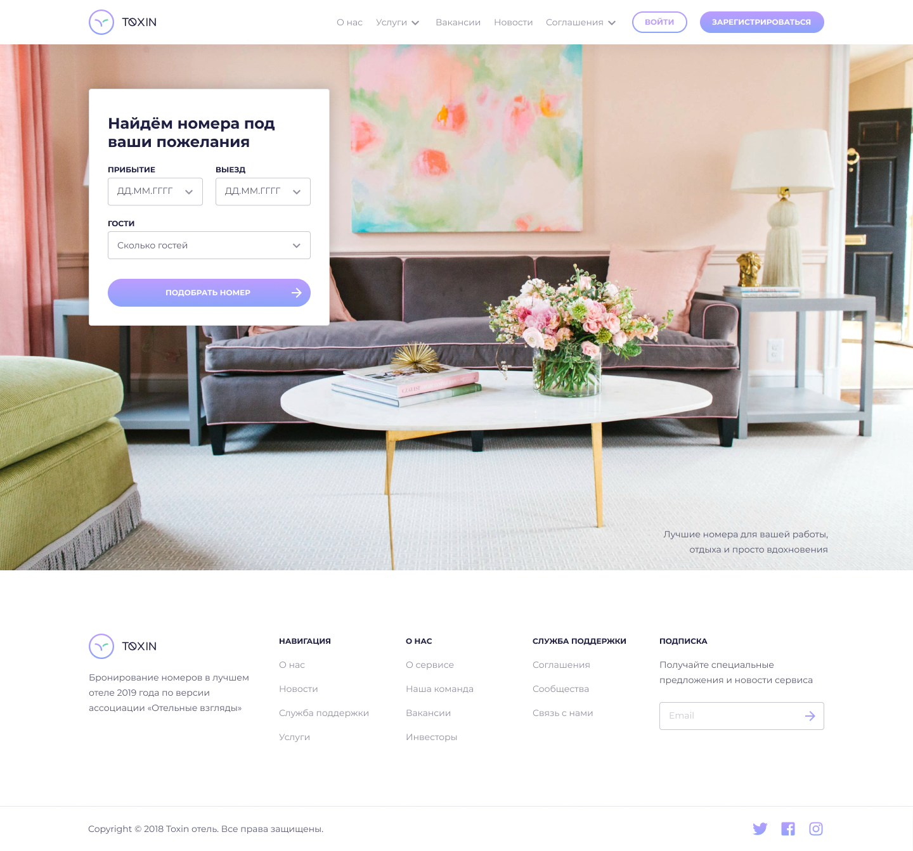
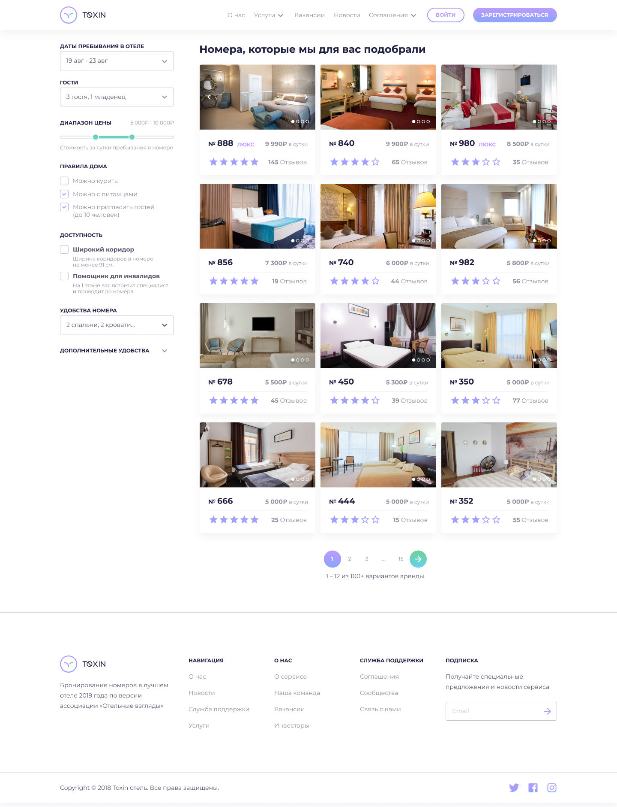
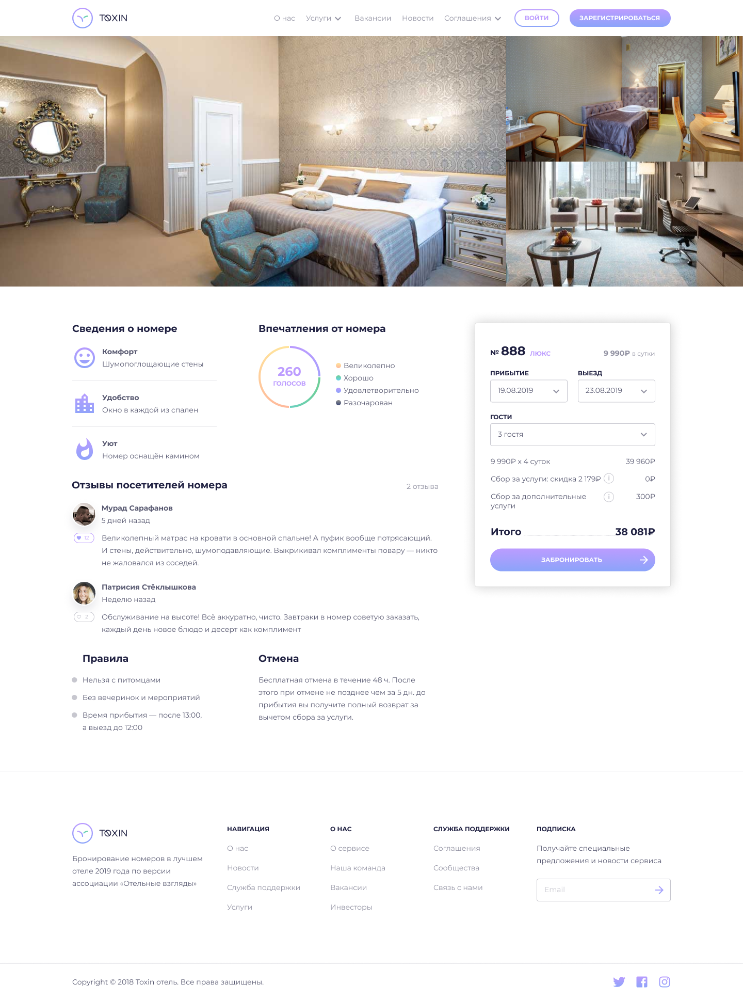
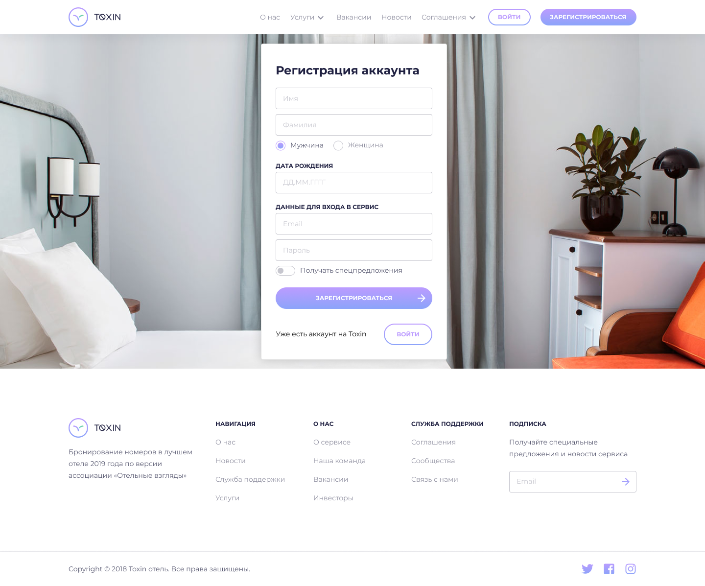
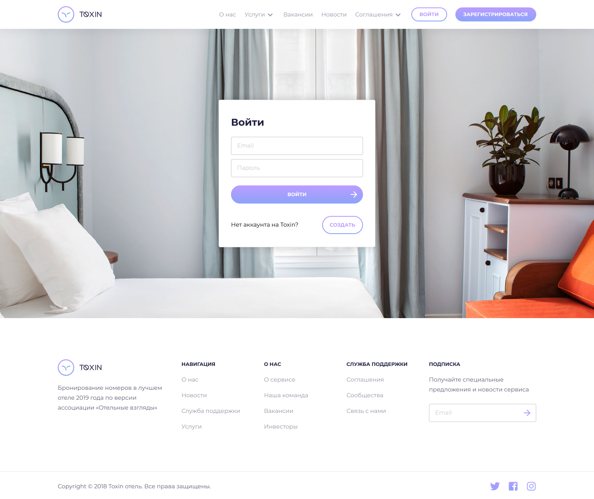

# TOXIN
Макет страниц по поиску номеров в отеле

## GitHub Pages
  https://wzdorowa.github.io/TOXIN/

## Клонирование
`git clone https://github.com/wzdorowa/TOXIN`

## Установка пакетов
`npm install`

## Команды
Сборка проекта: `npm run dev`

## Макеты

| Landing page | Search room | Room details | Registration | Sign in |
| :-----------: | :---------: | :-----------: | :-----------: | :------: |
|   |  |  |  |  |
# Сторонние библиотеки
В проекте используются следующие библиотеки:

## "jquery": "^3.5.1"
jQuery — набор функций JavaScript, фокусирующийся на взаимодействии JavaScript и HTML. Библиотека jQuery помогает легко получать доступ к любому элементу DOM, обращаться к атрибутам и содержимому элементов DOM, манипулировать ими.

## "jquery-ui-dist": "^1.12.1"
jQuery UI это тщательно подобранный набор взаимодействий, эффектов, виджетов и тем пользовательского интерфейса, созданный на основе библиотеки jQuery JavaScript.

## "parcel-bundler": "^1.12.4"
Parcel - сборщик веб-приложений.

## "pug": "^2.0.4"
Pug — это шаблонизатор Html, написанный на языке JavaScript для Node.js. После интерпретации сервером синтаксис Pug превращается в Нtml код. Старое название Pug — Jade.

## "sass": "^1.29.0"
Sass — это метаязык на основе CSS, предназначенный для увеличения уровня абстракции CSS-кода и упрощения файлов каскадных таблиц стилей.